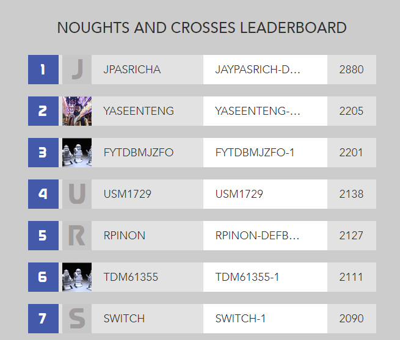

# AIGaming.com - Noughts and Crosses
## Challenge:
### _How quickly can you create a bot that is never beaten (but, unfortunately, will never win)?_

# Performance

 

My bot succeeds in this challenge as it consistently draws with ***Housebot-competition***.

My bot came in **second place out of several thousand participants!**
 
 

Against ***Housebot-practice***, I achieved:
* A win rate of 96/100
  * (3 draws and 1 loss)

 

 
 

# Links
For more inforamtion about this game, and to check my place on the leaderboard :wink:, please check out [AIGaming.com](https://www.aigaming.com/GameInfo/GameTypes?type=53)
